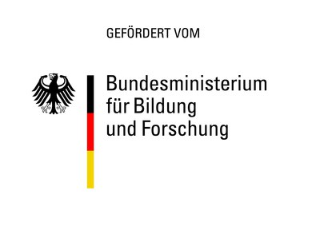

# Fhirdigo (Indigo FHIR Sync)

Eine Desktop-Anwendung zum Einlesen von Patientendaten aus CSV-Dateien, deren Konvertierung in standardisierte **HL7 FHIR** `Patient`-Ressourcen und der Synchronisation bzw. dem Upload an ein FHIR-kompatibles Backend (z. B. MyOncare).

---

## 🚀 Funktionen

- **Moderne Benutzeroberfläche**: Entwickelt mit [CustomTkinter](https://github.com/TomSchimansky/CustomTkinter) inklusive Dark-Mode-Unterstützung.
- **Drag & Drop & Dateiauswahl**: Einfaches Laden von CSV-Dateien per Drag-and-Drop oder über den Standard-Dateidialog.
- **Intelligente CSV-Verarbeitung**:
  - Automatische Erkennung des Trennzeichens (Komma `,` oder Semikolon `;`).
  - Unterstützung mehrerer Zeichenkodierungen (`utf-8-sig`, `utf-8`, `windows-1252`, `iso-8859-1`).
- **FHIR R4-Mapping**:
  - Automatische Transformation von CSV-Zeilen in HL7 FHIR `Patient`-JSON-Strukturen.
  - Standardisierung von Datumsformaten (Konvertierung von `TT.MM.JJJJ` nach `JJJJ-MM-TT`).
  - Normalisierung von Geschlechtsangaben (`M`, `W`, `D` zu FHIR-konformen Werten).
  - Zuordnung von Krankenhaus- und Organisations-Identifikatoren (z. B. UKSH, MyOncare Fallnummern / Patienten-IDs).
- **Direkter REST-Upload**: Stapelweiser Upload der transformierten FHIR-Ressourcen an den konfigurierten FHIR-Endpunkt.

---

## 📋 Voraussetzungen & Anforderungen

- **Python**: 3.10+ (getestet mit Python 3.14)
- **Conda** oder **pip**

### Abhängigkeiten

- [`customtkinter`](https://github.com/TomSchimansky/CustomTkinter) – Moderne GUI-Bibliothek
- [`requests`](https://requests.readthedocs.io/) – HTTP-Client für FHIR-REST-Uploads
- [`fhirpy`](https://github.com/beda-software/fhirpy) – FHIR-Client-Bibliothek für Python
- [`tkinterdnd2`](https://github.com/pmgagne/tkinterdnd2) – Drag & Drop-Unterstützung für Tkinter/CustomTkinter
- [`python-dotenv`](https://github.com/theskumar/python-dotenv) – Laden von Umgebungsvariablen aus `.env`

---

## 🛠️ Installation & Einrichtung

### Option 1: Conda-Umgebung (Empfohlen)

Erstelle und aktiviere die Umgebung anhand der Datei `tools/environment.yaml`:

```bash
# Conda-Umgebung erstellen
conda env create -f tools/environment.yaml

# Umgebung aktivieren
conda activate fhirdigo
```

### Option 2: Standard pip-Installation

```bash
# Virtuelle Umgebung erstellen und aktivieren
python -m venv .venv
source .venv/bin/activate  # Unter Windows: .venv\Scripts\activate

# Benötigte Pakete installieren
pip install customtkinter requests fhirpy fhir.resources tkinterdnd2 python-dotenv
```

### Konfiguration (.env)

Kopiere die Vorlage `.env.example` nach `.env` und passe die Zugangsdaten an:

```bash
cp .env.example .env
```

Trage in der Datei `.env` deinen FHIR-Endpunkt und den API-Schlüssel ein:

```env
FHIR_BASE_URL=https://token.myoncare.care/firebaseManager/fhir
FHIR_AUTH_KEY=dein_geheimer_api_schluessel
FHIR_INSTITUTION_ID=1
```

---

## 💻 Verwendung

### Hauptanwendung starten

Starte die CSV-zu-FHIR-Synchronisationsanwendung:

```bash
python IndigoSync.py
```

1. Klicke auf **📁 CSV-Datei öffnen** oder ziehe eine `.csv`-Datei per Drag & Drop in das Fenster.
2. Das Programm verarbeitet die Datensätze und zeigt die Anzahl der erkannten Patienten an.
3. Klicke auf **🔥 FHIR upload**, um die FHIR-Patientenressourcen an den FHIR-Server zu übertragen.


### Eigenständige App erstellen (Build)

Mit dem mitgelieferten Build-Skript kann eine eigenständig lauffähige Anwendung (z. B. `.app` auf macOS oder `.exe` auf Windows) erzeugt werden:

```bash
python build.py
```

Das fertige Programm wird im Ordner `dist/` abgelegt.

---

## 📄 Erwartetes CSV-Format

Der CSV-Parser unterstützt die gängigen Spaltenbezeichnungen aus Krankenhaus-Exporten:

| Spaltenname | Beschreibung | Beispiel |
| :--- | :--- | :--- |
| `Hauptfall` | Fallnummer / Patienten-Identifikator | `10023456` |
| `Name` | Nachname des Patienten | `Mustermann` |
| `Vorname` | Vorname des Patienten | `Max` |
| `Geb_Datum` | Geburtsdatum (`TT.MM.JJJJ`) | `15.08.1980` |
| `GESCHLECHT` | Geschlecht (`M`, `W`, `D`, `male`, `female`) | `M` |
| `Aufnahme` | Aufnahmedatum (`TT.MM.JJJJ`) | `01.03.2026` |
| `Entlassung` | Entlassungsdatum (`TT.MM.JJJJ`) *(optional)* | `10.03.2026` |
| `OE_DFD` | Abteilung / Organisationseinheit *(optional)* | `Chirurgie` |
| `ICD_HD` | Hauptdiagnose-Code *(optional)* | `C50.9` |
| `ICPM` | OPS-Prozedurencode *(optional)* | `5-894` |

---

## 📂 Projektstruktur

```text
Fhirdigo/
├── IndigoSync.py        # Hauptanwendung (CustomTkinter) für CSV-zu-FHIR Sync
├── build.py             # Automatisches Build-Skript (PyInstaller)
├── test.py              # Testskript für asynchrone FHIR-Client-Abfragen
├── .env.example         # Vorlage für Umgebungsvariablen (wird versioniert)
├── .env                 # Lokale Konfiguration & Geheimnisse (ignoriert via .gitignore)
├── assets/              # Logo- und Bildressourcen (z. B. BMBF-Förderlogo)
├── tools/
│   └── environment.yaml # Conda-Umgebungsdefinition
└── README.md            # Projektdokumentation
```

---

## 🔒 Konfiguration & Sicherheit

- **FHIR-Endpunkt & Authentifizierung**: Werden über Umgebungsvariablen (`.env`) verwaltet.
- **Git-Sicherheit**: Die `.env`-Datei ist in der `.gitignore` hinterlegt und wird **nicht** in das GitHub-Repository hochgeladen. Nutzen Sie `.env.example` als Vorlage für neue Installationen.

---

## 🏛️ Förderhinweis

<p align="center">
  
</p>

Dieses Projekt entstand im Rahmen des folgenden Forschungsvorhabens:

- **Förderung**: Bundesministerium für Bildung und Forschung (BMBF)
- **Projektträger**: VDI Technologiezentrum GmbH
- **Verbundprojekt**: Integrierte Digitale Gesundheitsplattform entlang der operativen Versorgungskette (InDiGo)
- **Teilvorhaben**: Konvergenz klinischer Informationssysteme mit der Patientenperspektive in der digitalen Gesundheitsplattform
- **Ausführende Stelle**: Universitätsklinikum Schleswig-Holstein – Campus Lübeck – Klinik für Orthopädie und Unfallchirurgie
- **Projektleitung**: Dr. Robert Wendlandt
- **Förderkennzeichen**: `13GW0562E`
